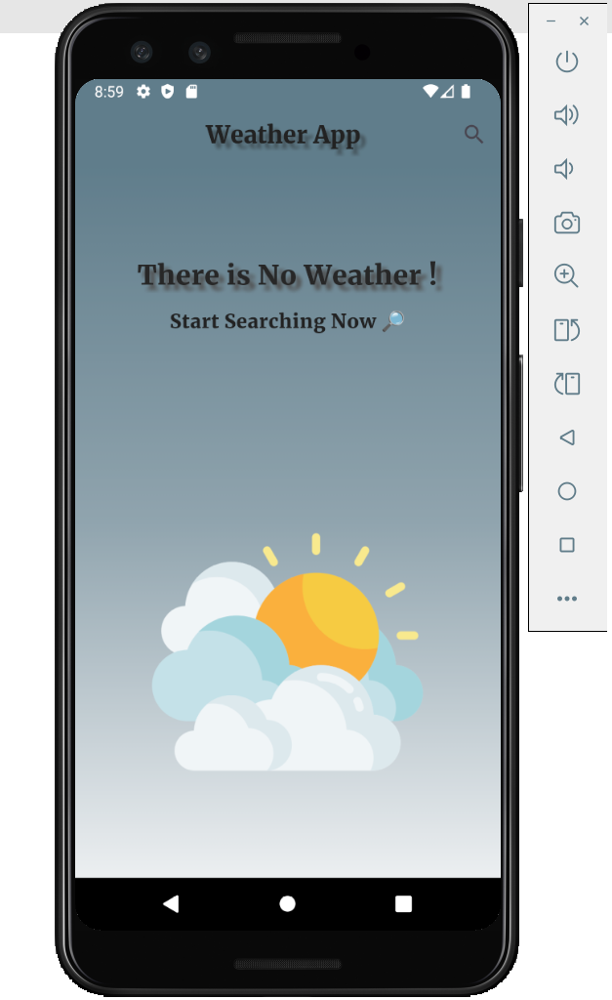
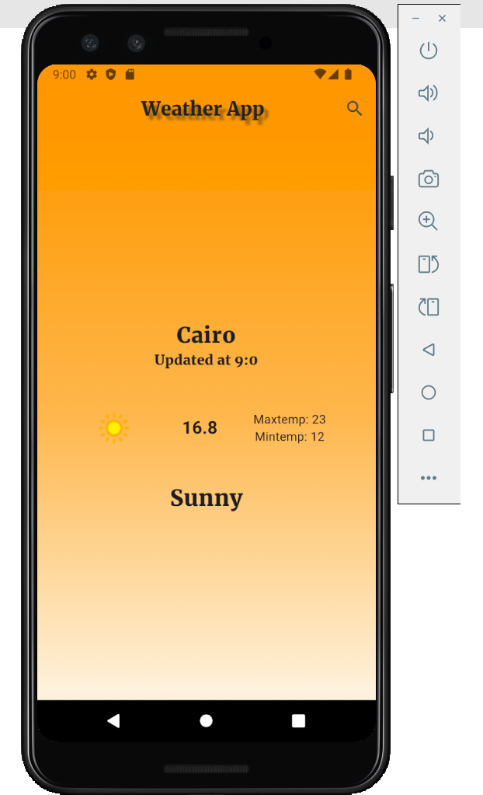
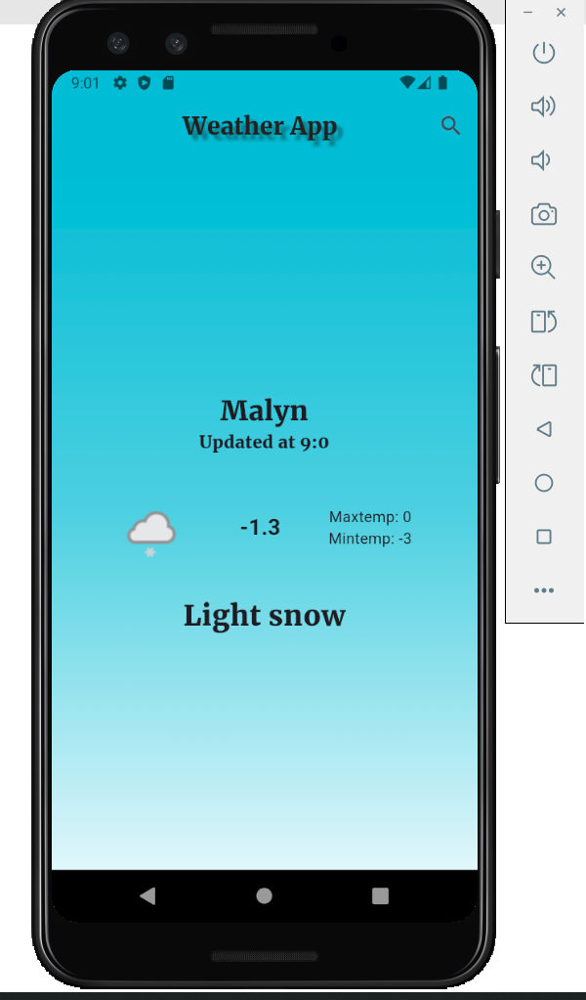

# Weather App ☀️🌧️

This is a Flutter-based weather application that provides real-time weather updates for users. The app is designed with a simple and user-friendly interface.

## Features
- 🌍 **Current Weather:** Displays the current weather of your location.
- 🕒 **Hourly Forecast:** Get hourly weather updates.
- 🔄 **Refresh:** Updates weather data instantly.

## Screenshots
Here are some screenshots of the application:

|  <br> **Home Screen** |  <br> **Weather Details** |
|------------------------------------------------|------------------------------------------------|
|  <br> **Weekly Forecast** |  <br> **Search Screen** |

## Installation
1. Clone the repository:
   ```bash
   git clone https://github.com/romisaa5/Weather_app.git
